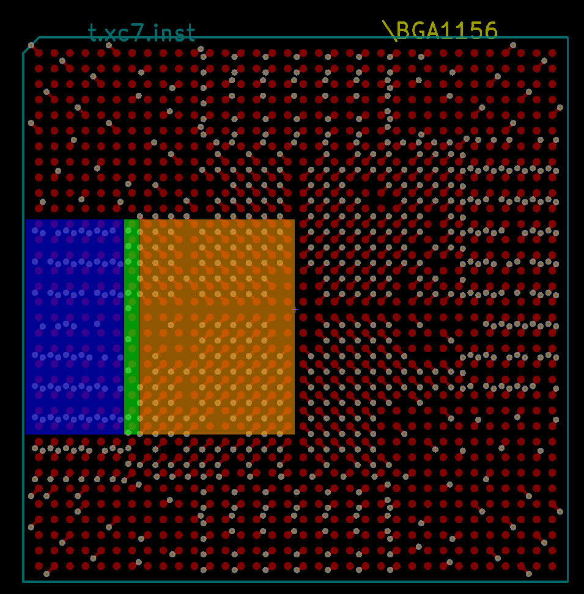

# kicad-bga-tools
Tools to make life easier for PCB design with BGA's

The main script(bga_dogbone.py) creates dogbone vias for all pads with connected nodes on a Kicad PCB component(module).

The component is assumed to be a normal non-rotated BGA component with equally spaced pads in both direction. If there are missing pads this doesn't break the script but isn't handled in any special way at the moment.

The BGA is handled as:
```
xxxxxx
xoeeox
xeooex
xeooex
xoeeox
xxxxxx
```

Where `x` is a skipped pad. `e` gets an edge via(shifted column/row style), and `o` gets a normal quadrant dogbone via. Any inner layer vias laying out to an edge via will get a transition via in the shifted style.

In the above example the numbers would be: skip_outer=1, edge_layers=2

If edge_layers=0 then only quadrant dogbone vias will be created.

## Example

Example with edge_layers=6, and skip_outer=0. Blue indicates shifted column/row vias, green is the transition layer, and orange is the rest which are fanned out with normal dogbone vias.


